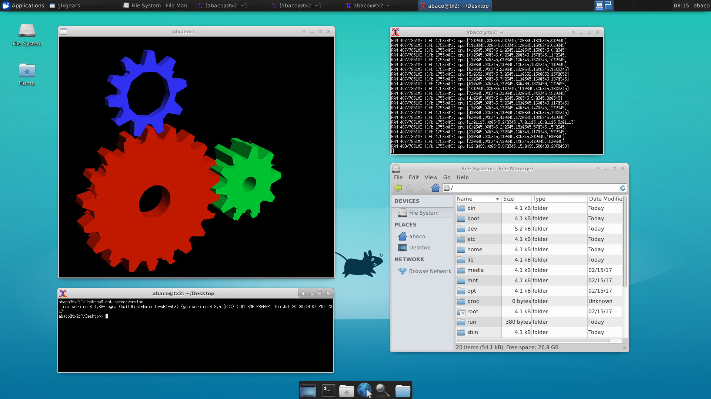
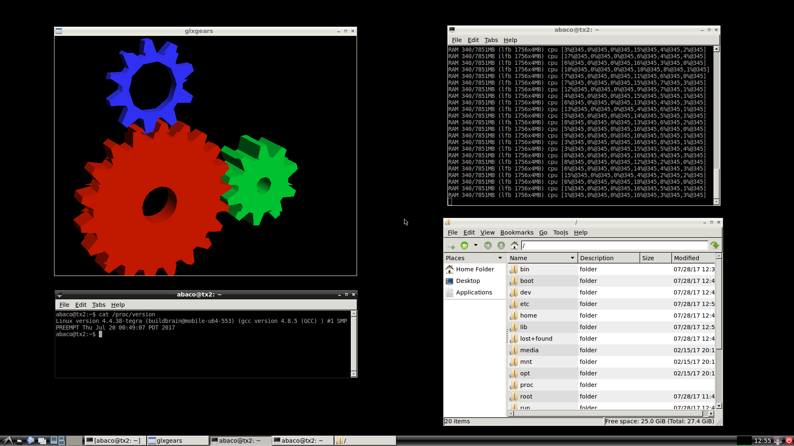

# Sample Filesystems (nVidia Tegra TX2)

These are some example TX2 sample file systems that can be used as an alternative to the tegra sample filesystem provided by nVidia. These filesystems are lean and more suited to Embedded Developments where you do not require a full desktop experiance. You can add in the components you need to build up your filesystem to meet your requirements using **apt-get**.

These have been tested against the latest L4T R28.1 (July 2017).

* Debootstrap created Xenial filesystem with minimal command line only - [Tegra_Linux_Sample-Root-Filesystem_Debootstrap_cmdline_aarch64.tbz2](https://github.com/Abaco-Systems/tx2-sample-filesystems/releases/download/R28_1/Tegra_Linux_Sample-Root-Filesystem_Debootstrap_cmdline_aarch64.tbz2)
* Debootstrap created Xenial filesystem with minimal Xfce4 Desktop Environment - [Tegra_Linux_Sample-Root-Filesystem_Debootstrap_xfce4_aarch64.tbz2](https://github.com/Abaco-Systems/tx2-sample-filesystems/releases/download/R28_1/Tegra_Linux_Sample-Root-Filesystem_Debootstrap_xfce4_aarch64.tbz2)
* Debootstrap created Xenial filesystem with minimal Lxde Desktop Environment only - [Tegra_Linux_Sample-Root-Filesystem_Debootstrap_lxde_aarch64.tbz2](https://github.com/Abaco-Systems/tx2-sample-filesystems/releases/download/R28_1/Tegra_Linux_Sample-Root-Filesystem_Debootstrap_lxde_aarch64.tbz2)

To flash these images follow the [Quickstart Guide](https://developer.nvidia.com/embedded/dlc/l4t-quick-start-guide-28-1) on the nVidia website and substitue these filesystems for the nVidia sample filesystem.

NOTE
> Command line only filesystem includes some additional packages to get you going these include ethtool, isc-dhcp-client, nano, net-tools, pci-utils, ping, sudo, udev. Xfce4 Desktop Environment also contains these tools plut a minimal Desktop Environment. 

All file systems come with one administrator user account  
password : **abaco**  
username : **abaco**

Due to the size of the images they are available as Releases. Please download Release R28_1.

# Debootstrap
Systems created with [Debootstrap](https://wiki.debian.org/Debootstrap).

An example script showing how you can get started with the Jetson TX2:

```
#!/bin/bash
apt-get install debootstrap
mkdir ./Linux_for_Tegra
export ARCH=arm64
PACKAGE=nano
RELEASE=xenial

debootstrap \
        --arch=$ARCH \
        --keyring=/usr/share/keyrings/ubuntu-archive-keyring.gpg \
        --verbose \
        --foreign \
        --variant=minbase \
        --include=$PACKAGE \
        $RELEASE \
        ./Linux_for_Tegra/rootfs
cp /usr/bin/qemu-aarch64-static ./Linux_for_Tegra/rootfs/usr/bin
cd ./Linux_for_Tegra/rootfs
chroot . /bin/bash -c "/debootstrap/debootstrap --second-stage" 
# Open a QEMU shell to make any additional modifications. You can use apt-get at this point.
chroot . /bin/bash 
# When done create a filesystem archive
sudo tar -cvjSf Tegra_Linux_Sample-Root-Filesystem_${RELEASE}_${PACKAGE}_aarch64.tbz2 *
cd -
```

Additional packages can be specified in your file system if you add them to --include. The example above will include the text editor **nano**. Examples assumes a forign host i,e, Intel x86_64 Linux, tested on Ubuntu 16.04 LTS.

A word of warning you will need to configure your filesystem as this will not function without some basic setup and accont creation prior to flashing. The sample filesystems above have been pre-configured to come up working. There is a great article on the Debian website that will help you setup your filesystem [here](https://www.debian.org/releases/stable/amd64/apds03.html.en).


Debootstrap filesystem running Xfce4 Desktop Environment.


Debootstrap filesystem running Lxde Desktop Environment.

# Ubuntu Base
Pre made minimal filesystems are also available from Ubuntu and are reffered to as [Ubuntu Base](https://wiki.ubuntu.com/Base).

# Links
* [Linux For Tegra R28.1](https://developer.nvidia.com/embedded/linux-tegra)
* [GVC1000 Rugged TX2](https://www.abaco.com/products/gvc1000)
* [eLinux setup tips](http://elinux.org/Jetson/TX2_Ubuntu_Base)


