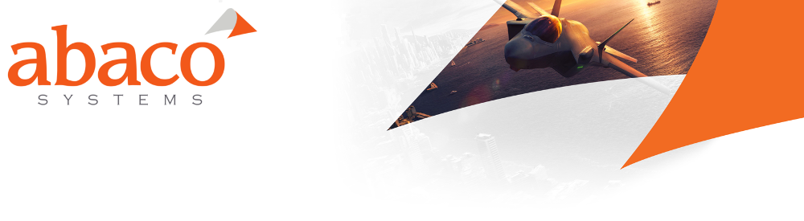

# Sample Filesystems (nVidia Tegra TX2)

These are some example TX sample file systems that can be used as an alternative to the tegra sample filesystem provided by nVidia.

These have been tested against the latest L4T R28.1 (July 2017).

* Debootstrap created Xenial filesystem with minimal Xfce4 Desktop Environment
* Debootstrap created Xenial filesystem with minimal command line only

NOTE
> Command line only filesystem includes some additional packaged to get you going these include ethtool, isc-dhcp-client, nano, net-tools, pci-utils, ping, sudo, udev. Xfce4 Desktop Environment also contains these tools plut a minimal Desktop Environment. 

All file systems come with one administrator user account  
password : **abaco**  
username : **abaco**

# Debootstrap
Systems created with [Debootstrap](https://wiki.debian.org/Debootstrap).

An example script showing how you can get started with the Jetson TX2:

```
#!/bin/bash
apt-get install debootstrap
rm -rf ./Linux_for_Tegra
mkdir ./Linux_for_Tegra
export ARCH=arm64
PACKAGE=ubuntu-desktop
RELEASE=xenial

debootstrap \
        --arch=$ARCH \
        --keyring=/usr/share/keyrings/ubuntu-archive-keyring.gpg \
        --verbose \
        --foreign \
        --variant=minbase \
        --include=$PACKAGE \
        $RELEASE \
        ./Linux_for_Tegra/rootfs
cp /usr/bin/qemu-aarch64-static ./Linux_for_Tegra/rootfs/usr/bin
cd ./Linux_for_Tegra/rootfs
chroot . /bin/bash -c "/debootstrap/debootstrap --second-stage" 
# Open a QEMU shell to make any additional modifications. You can use apt-get at this point.
chroot . /bin/bash 
# When done create a filesystem archive
sudo tar -cvjSf Tegra_Linux_Sample-Root-Filesystem_${RELEASE}_${PACKAGE}_aarch64.tbz2 *
cd -
```

# Ubuntu Base
Pre made minimal filesystems are also available from Ubuntu and are reffered to as [Ubuntu Base](https://wiki.ubuntu.com/Base).


